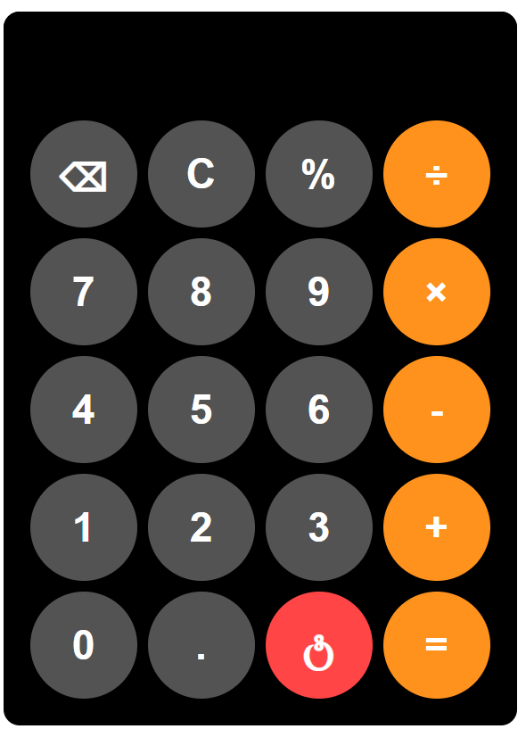

# 🧮 Calculator App

A modern and responsive calculator built using **HTML, CSS, and JavaScript**. This project provides an intuitive user interface inspired by smartphone calculators and supports essential arithmetic operations with a clean and interactive design.



## ✨ Features

* ➕ Addition
* ➖ Subtraction
* ✖️ Multiplication
* ➗ Division
* 📊 Percentage Calculation
* ⌫ Backspace Functionality
* 🧹 Clear Display Option
* ⏻ Power Button Simulation
* 🎨 Modern Dark-Themed UI
* ⚡ Interactive Hover Effects
* 📱 Responsive Design

## 🛠️ Technologies Used

* HTML5
* CSS3
* JavaScript (ES6)

## 📂 Project Structure

```
calculator-app/
├── index.html
├── index.css
├── index.js
├── README.md
└── assets/
    └── calculator-preview.png
```

## 🚀 Getting Started

### Clone the Repository

```bash
git clone https://github.com/kothurisaiteja/calculator-app.git
```

### Navigate to the Project Folder

```bash
cd calculator-app
```

### Run the Application

Open `index.html` in your preferred web browser to start using the calculator.

## 📸 Preview

This calculator features a sleek dark interface with circular buttons, highlighted operators, percentage support, and a dedicated power button that displays a shutdown message for an enhanced user experience.

## 🎯 Learning Outcomes

Through this project, I gained hands-on experience with:

* DOM Manipulation
* Event Handling
* JavaScript Functions
* CSS Grid Layout
* Responsive UI Design
* Building Interactive Web Applications

## 🔮 Future Improvements

* Keyboard Support
* Scientific Calculator Functions
* Calculation History
* Theme Switching (Light/Dark Mode)

## 👨‍💻 Author

**Sai Teja**

GitHub: https://github.com/kothurisaiteja

---

⭐ If you found this project useful, consider giving it a star!
